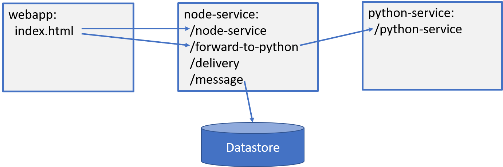
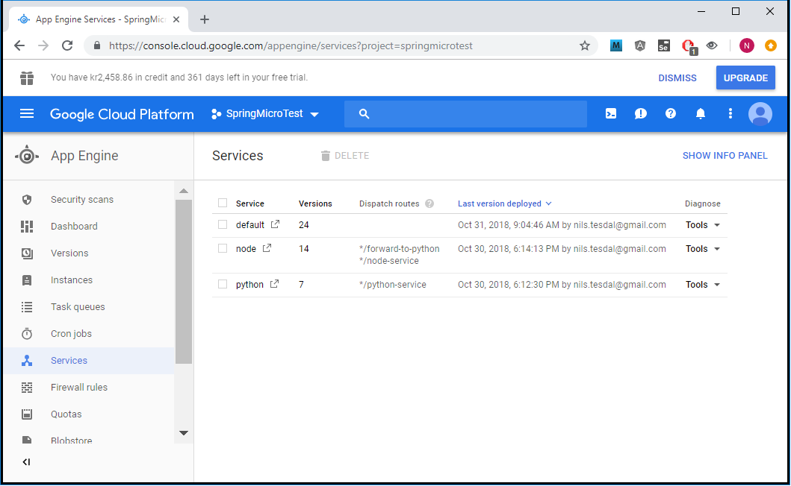

# gae-micro

# Introduksjon

Dette prosjektet inneholder en superenkel webapplikasjon og to mikrotjenester som kan deployes på Google App Engine.
Den ene tjenesten er skrevet JavaScript/Node og den andre med Python/Flask.
Webapplikasjonen er hostet på Node.
Når disse tre tjenestene deployes på Google App Engine vil hver av dem kjøre i hver sin egen Docker-container og tilsammen utgjøre en applikasjon.

For å bruke Google App Engine må dere opprette en konto på [https://cloud.google.com/](https://cloud.google.com/).
Velg "Try free". Her er dere er nødt til å legge til kredittkortopplysninger, men dere skal få beskjed hvis limit'en er nådd og dere må begynne å betale. Det er ett års fri bruk.

Opprett et prosjekt (øverst, ganske langt til venstre) og gi det et passe navn. Du kan bruke det genererte navnet eller finne et selv som ikke er brukt tidligere. 
Navnet vil bestemme URL'en til tjenestene: [https://prosjektnavnet.appspot.com](https://prosjektnavnet.appspot.com).

Du må også laste ned og installere Google Could SDK: [https://cloud.google.com/sdk/downloads](https://cloud.google.com/sdk/downloads). 
Etterpå kan du åpne et konsoll (f.eks. Git Bash) og skrive:

```
gcloud init
```

Da vil du bli bedt om å logge på Google-kontoen din, og velge AppEngine prosjekt (som du nettopp lagde).

# Tjenestene



## Web-app

Denne tjenesten er laget med node.js som server statiske websider. 
Webapplikasjonen består av to filer; [index.html](webapp/public/index.html) og [main.css](webapp/public/main.css) som begge ligger under katalogen [/public](webapp/public). 
På rotkatalogen til tjensten, [/webapp](webapp), ligger [app.js](webapp/app.js) og [package.json](webapp/package.json) som gjør at de statiske filene kan serves på en node.js-server med *express*.
I tillegg har vi fila [app.yaml](webapp/app.yaml) som gjør at vi kan deploye denne webapplikasjonen på Google App Engine:

```
gcloud app deploy app.yaml
```

Etter den er deployet vil den være tilgjengelig på URL'en:

[https://prosjektnavn.appspot.com](https://prosjektnavn.appspot.com)

Web-applikasjonen kan også startes lokalt med kommandoen:

```
npm install
npm start
```

Da vil den bli tilgjengelig på:

[http://localhost:8080](http://localhost:8080)

Applikasjonen gjør veldig lite ([index.html](webapp/public/index.html)):
* Den skriver ut en melding: "Hello from webapp"
* Kjører et ajax-kall til /node-service på node-service'n og skriver ut resultatet på websida
* Kjører et kall til /forward-to-python på node service'n som videresender kallet til python-service'n og skriver ut resultatet på websida

[app.yaml](webapp/app.yaml) bestemmer hvilket type miljø (runtime) tjenesten skal kjøre i. I dette prosjektet brukes enkle *standard*-miljø. 
Vi kunne også valgt *flex*-miljø som resulterer i at at tjenestene starter i egne Docker-containere. 
Les mer om miljø her [https://cloud.google.com/appengine/docs/the-appengine-environments](https://cloud.google.com/appengine/docs/the-appengine-environments).


## Node-tjeneste

Installer denne på Google App Engine ved å gå inn i *node-service*-mappa og skrive:

```
gcloud app deploy node-app.yaml
```

Tjenesten har to endepunkter som i skyen blir tilgjengelig på:

* [https://node-dot-prosjektnavn.appspot.com/node-service](https://node-dot-prosjektnavn.appspot.com/node-service)
* [https://node-dot-prosjektnavn.appspot.com/forward-to-python](https://node-dot-prosjektnavn.appspot.com/forward-to-python)

Det første endepunktet skal nå virke og returnere en enkel JSON med en "Hello"-melding.

```
{"message":"Hello from Node!"}
```

Det andre endepunktet videresender kall et til python-servicen som enda ikke er oppe så på nåværende tidspunkt skal denne returnere en feil.

Denne tjenesten kan også kjøres lokalt med:

```
npm install
npm start
```

Det første endepunktet vil fungere lokalt, mens det andre ikke vil det:
* [http://localhost:8080/node-service](http://localhost:8080/node-service)
* [http://localhost:8080/forward-to-python](http://localhost:8080/forward-to-python)

Merk at tjenestene webapp og node-service ikke kan kjøre lokalt samtidig. 

## Python-tjeneste

Python-tjenesten bruker *Flask*-biblioteket for å opprette en web-server og serve REST-endepunkter.
Den bruker en source-fil, [main.py](python-service/main.py), 
har en fil som forteller hvilke versjoner vi skal bruke av bibliotekene (Flask), [requirements.txt](python-service/requirements.txt) 
og en fil, [python-app.yaml](python-service/python-app.yaml), som forteller Google Appe Engine hvilken runtime som skal brukes og hva tjenesten skal hete.

Når du står i mappen *python-service* kan du kjøre følghende for å deploye:
```
gcloud app deploy python-app.yaml
```

Denne kan også kjøres lokalt hvis du har python (3) installert. Gå inn i mappa *python-service* og skriv:

```
python main.py
```

Tjensten blir da tilgjengelig på: [http://localhost:5000/python-service](http://localhost:5000/python-service).

Denne responderer på GET og returnerer en enkel melding på JSON-format:

```
{
  "message": "Hello from Python!"
}
```

## Administrere tjenestene

For å liste opp alle tjenestene du har installert i skyen kan du skrive:

```
gcloud app services list
```

```
SERVICE  NUM_VERSIONS
default  12
node     8
python   4
```

Du kan undeploye tjenester slik:

```
gcloud app services delete service1 service2
```

(du kan ikke fjerne default-servicen)

Mesteparten kan imidlertid også gjøres i skyen: [https://console.cloud.google.com](https://console.cloud.google.com).

Velg `App Engine` og `Services` fra menyen (eller gå rett inn på [https://console.cloud.google.com/appengine/services](https://console.cloud.google.com/appengine/services)). Her kan du gå inn på de tre deployede tjenestene og f.eks. se på loggene. 



Velg f.eks. `Tools` og `Logs` for å se loggen til de individuelle tjenestene.

# Routing

I utgangspunktet er tjenestene tilgjeneglig på disse url'ene:
* Node-tjeneste: [https://prosjektnavn.appspot.com](https://prosjektnavn.appspot.com)
* Node-tjeneste: [https://node-dot-prosjektnavn.appspot.com](https://node-dot-prosjektnavn.appspot.com)
* Pyton-tjeneste: [https://python-dot-prosjektnavn.appspot.com](https://python-dot-prosjektnavn.appspot.com)

Men for å få til at de bruker samme base-url og derfor slipper CORS-problemer, kan vi legge til ruting av url'er. 
Fila [dispatch.yaml](dispatch.yaml) på rotkatalogen kan også deployes i skyen, og da vil alle tjenestene bli tilgjengelig på samme base-url:
* Node-endepunkt 1: [https://prosjektnavn.appspot.com/node-service](https://prosjektnavn.appspot.com/node-service)
* Node-endepunkt 2: [https://prosjektnavn.appspot.com/forward-to_python](https://prosjektnavn.appspot.com/forward-to_python)
* Pyton-endepunkt: [https://prosjektnavn.appspot.com/python-service](https://prosjektnavn.appspot.com/python-service)

```
gcloud app deploy dispatch.yaml
```

# Bruke Database

Google App Engine tilbyr flere ulike lkagringsmedium. Vi skal bruke den enkleste; `Datastore`. Dette er en NoSQL-style dokumentdatabase. 
Vi kan begynne å bruke denne helt uten videre, uten å opprette en instans eller noen databasedefinisjoner på forhånd.

Se koden på node-tjensten: [service.js](node-service/service.js). 
Vi bruker node-biblioteket `@google-cloud/datastore` og kan legge et nytt dokument med gitt *kind* som tilsvarer en tabell i SQL, men uten at denne må opprettes før vi begynner å bruke den.
Med *datastore.key(kind)* opprettes det automatisk en primærnøkkel, og vil legger til de data vi ønsker i *data: json* og bruker *datastore.save()* for å lagre denne. 
Denne returnerer et *Promise* som vi håndterer med *.then()* og *.catch()*.

POST-endepunktet henter alle meldingene ved å opprette en default-query mot `kind'en` message: *datastore.createQuery('message')* og senere *datastore.runQuery(query)*. 
Her kunne vi også skrevet en query med GQL (Google Query Language).

Node/express-tjenesten har to endepunkter på url'en */message* eller [https://node-dot-prosjektnavn.appspot.com/message](https://node-dot-prosjektnavn.appspot.com/message).
Her kan du bruke både POST og GET. Med POST kan man POST'e en JSON (f.eks. med POSTMAN):

```json
{ "message": "meldingen som skal legges inn i databasen" }
```

Med GET vil alle de lagrede meldingene listes. Her er det bare å lime inn url'en i nettleseren.

Du kan også sjekke innholdet i database i skyen ved å gå inn på [https://console.cloud.google.com/datastore](https://console.cloud.google.com/datastore). 
Her kan du velge entitet (kind) og se alle dokumenter lagret for disse. Det er også mulig å bruke GQL for å skrive spørringer.
